# 🎓 AI Tutor - Intelligent Learning Platform

A cutting-edge AI-powered tutoring platform built with **Next.js 16**, **React 19**, and powered by **Google Gemini** and **OpenAI APIs**. It provides a personalized learning experience with AI conversations, flashcard generation, and PDF processing.

---

# ✨ Key Features

## 🤖 AI-Powered Learning
- Real-time AI conversations using Google Gemini and OpenAI
- Intelligent flashcard generation
- PDF processing and content extraction

## 📊 Comprehensive Dashboard
- User management system
- Role-based access control
- Activity tracking and analytics
- Custom user settings

## 🔐 Secure Authentication
- Supabase authentication
- Role-Based Access Control (RBAC)
- Email verification
- Password reset system

## 📚 Content Management
- Upload and process PDF notes
- Flashcard creation and management
- Document organization
- Image support

## 🎨 Professional UI/UX
- Built with **Shadcn UI**
- Responsive design using **Tailwind CSS**
- Dark and Light theme
- Clean and accessible interface

---

# 📸 Screenshots & Preview

## 🔐 Authentication & Access Control

| Login Interface | Permissions Management |
|---|---|
| 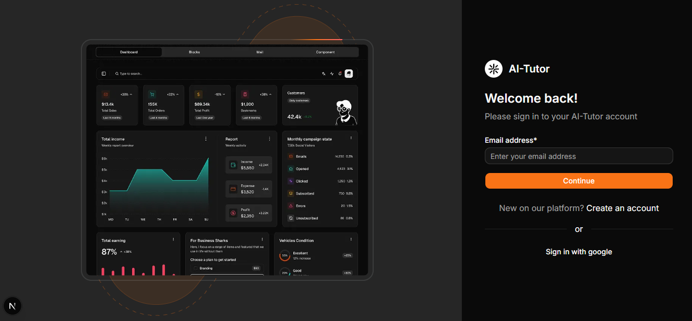 | 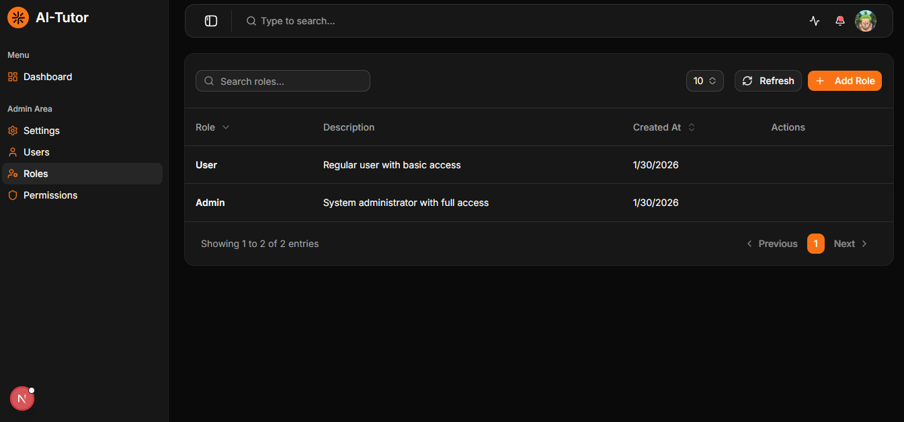 |

---

## 👥 User Management System

| Users Overview | Update User |
|---|---|
| 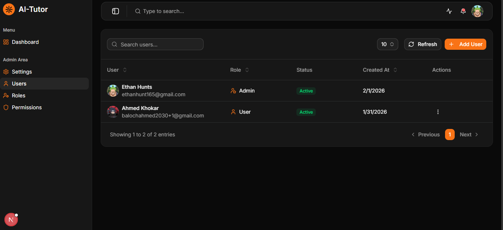 |  |

---

## 📊 Dashboard & Overview

| Dashboard | User Settings |
|---|---|
| 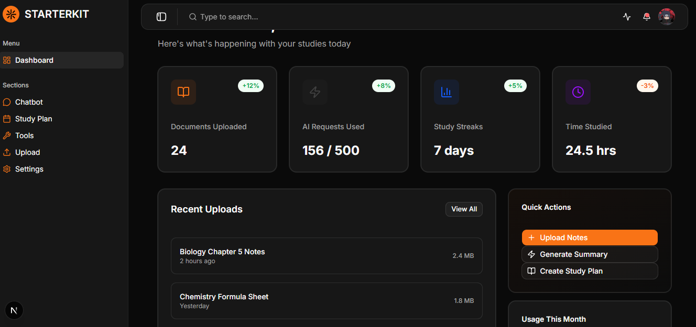 | 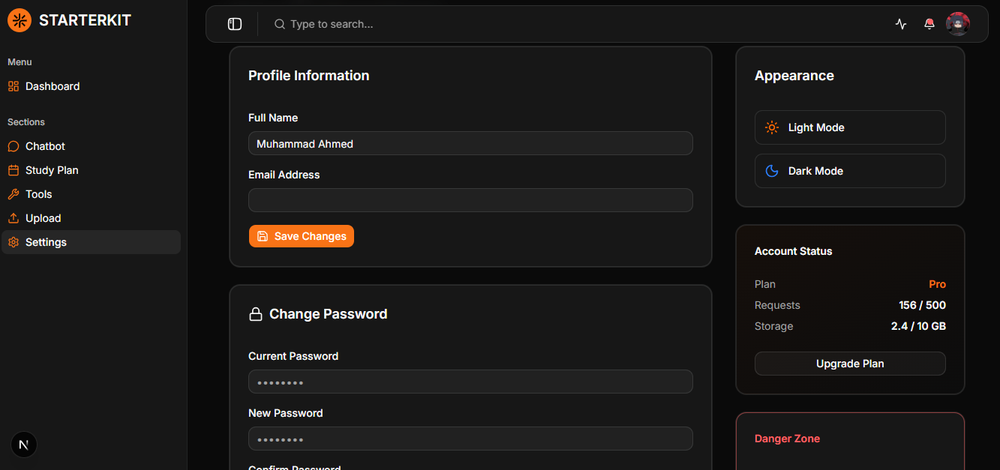 |

---

## 💬 AI Chatbot & Learning Tools

| AI Chatbot | AI Tools |
|---|---|
| 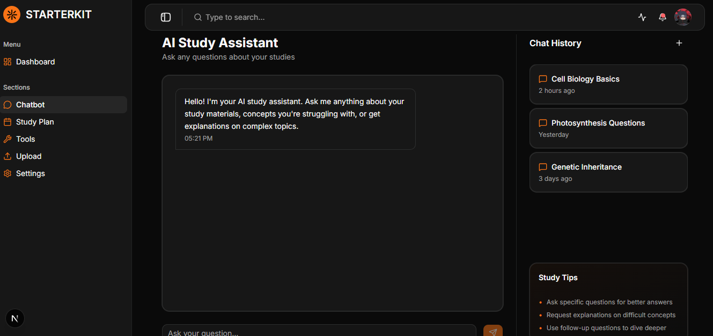 | 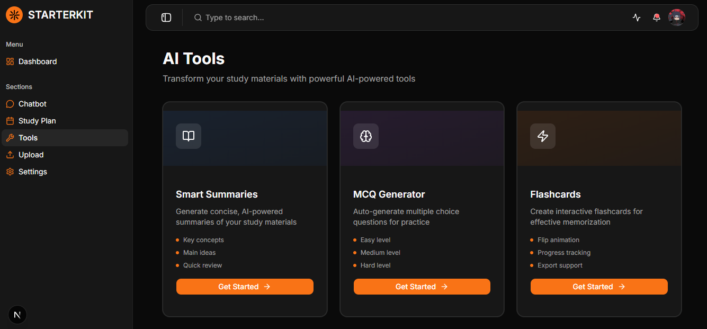 |

---

## 📚 Flashcard & Content Management

| Flashcards | Flashcard Answers |
|---|---|
| 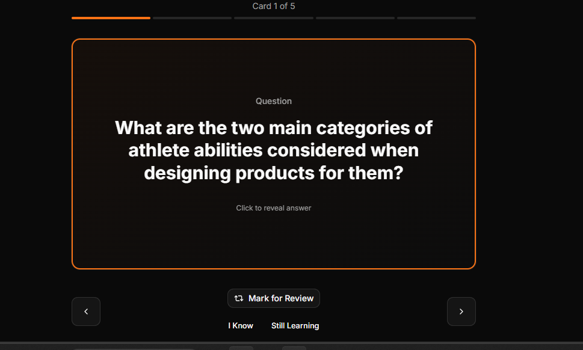 | 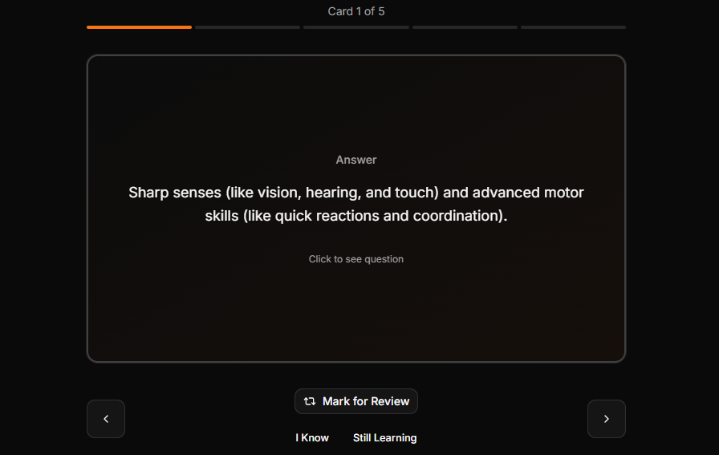 |

| Flashcards 1.0 | Summary Creation |
|---|---|
| 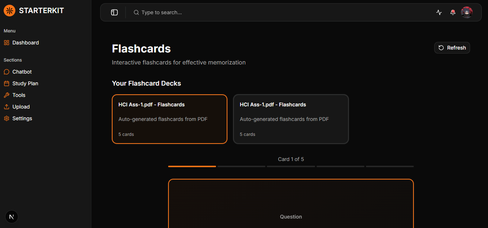 | 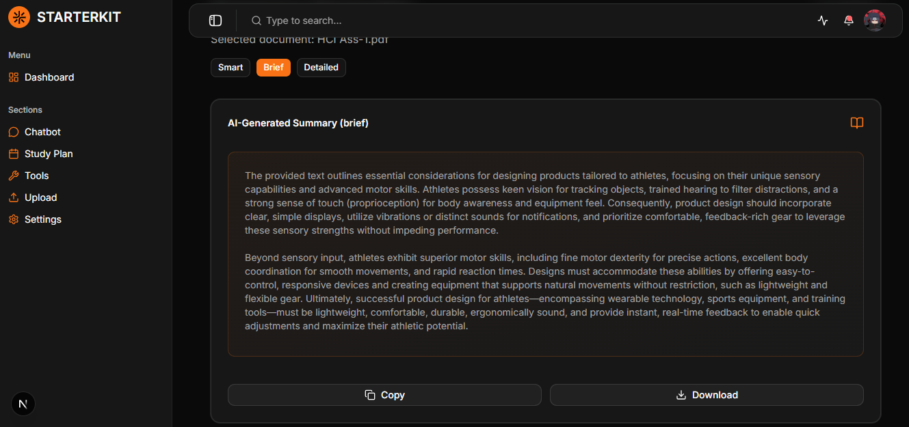 |

---

## 📝 Study & Content Tools

| Upload Notes | Study Schedule |
|---|---|
| 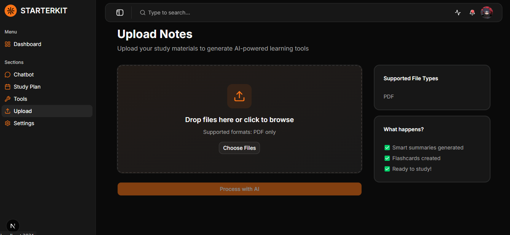 | 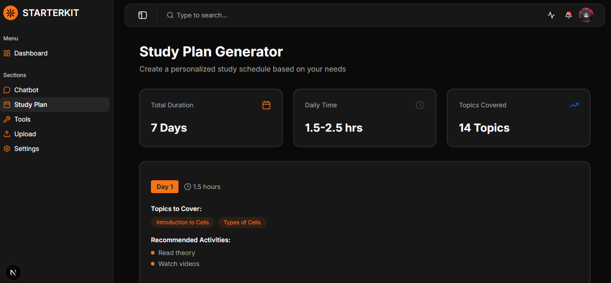 |

---

## ⚙️ Settings & Configuration

| Settings | Advanced Settings |
|---|---|
| 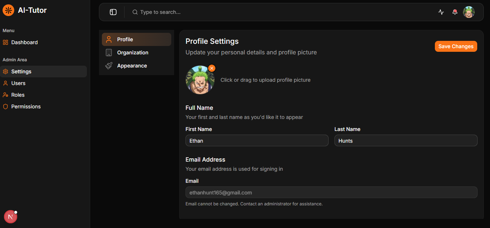 |  |

---

# 🚀 Getting Started

## Prerequisites

- Node.js **18.17+**
- npm / yarn / pnpm

Accounts required:
- Supabase
- Google Cloud (Gemini API)
- OpenAI

---

# Installation

## 1️⃣ Clone Repository

```bash
git clone https://github.com/yourusername/ai-tutor.git
cd ai-tutor
```

## 2️⃣ Install Dependencies

```bash
npm install
```

---

## 3️⃣ Setup Environment Variables

Create `.env.local`

```env
NEXT_PUBLIC_SUPABASE_URL=your_supabase_url
NEXT_PUBLIC_SUPABASE_ANON_KEY=your_supabase_key

OPENAI_API_KEY=your_openai_api_key
GOOGLE_GENERATIVE_AI_API_KEY=your_gemini_api_key

NEXT_PUBLIC_API_URL=http://localhost:3031
```

---

## 4️⃣ Run Development Server

```bash
npm run dev
```

Open browser

```
http://localhost:3031
```

---

# 🏗️ Project Structure

```
ai-tutor
│
├── app
│   ├── (dashboard)
│   ├── api
│   └── auth
│
├── components
│   ├── auth
│   ├── dashboard
│   ├── ui
│   └── data-table
│
├── lib
│   ├── email-service.ts
│   ├── graphql.ts
│   └── permissions.ts
│
├── modules
│   ├── users
│   ├── roles
│   ├── permissions
│   └── ai-conversations
│
├── types
├── utils
└── context
```

---

# 🔧 Tech Stack

## Frontend
- Next.js 16
- React 19
- TypeScript
- Tailwind CSS
- Shadcn UI
- TanStack Table

## Backend
- Supabase
- GraphQL
- REST APIs

## AI
- Google Gemini
- OpenAI
- Vercel AI SDK

## Libraries
- Resend
- Motion
- Recharts
- React Markdown
- PDF2JSON
- Lucide React
- Sonner

---

# 📝 Scripts

Development

```bash
npm run dev
```

Production

```bash
npm run build
npm start
```

Lint

```bash
npm run lint
```

---

# 🔐 Security Features

- Role-Based Access Control
- Permission management
- Secure Supabase authentication
- Email verification
- Password reset
- Protected API routes

---

# 📚 API Endpoints

## Authentication

```
POST /api/auth/login
POST /api/auth/signup
POST /api/auth/forgot-password
POST /api/auth/reset-password
GET /api/auth/verify
```

## AI Features

```
POST /api/chat
POST /api/geminiChat
POST /api/openai
POST /api/generate-flashcards
POST /api/process-pdf
```

## Admin

```
POST /api/role-access
POST /api/upload
POST /api/send-email
```

---

# 🚀 Deployment

### Deploy with Vercel

1. Push code to GitHub  
2. Import repository in Vercel  
3. Add environment variables  
4. Deploy  

Docs: https://nextjs.org/docs/deployment

---

# 🤝 Contributing

```bash
git checkout -b feature/new-feature
git commit -m "Add new feature"
git push origin feature/new-feature
```

Then open a Pull Request.

---

# 📄 License

MIT License

---

# 💬 Support

If you find issues, open a GitHub issue.

---

**Built with ❤️ using Next.js and AI**
