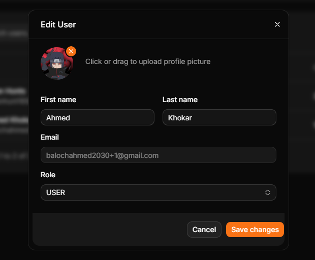

# 🎓 AI Tutor - Intelligent Learning Platform

A cutting-edge AI-powered tutoring platform built with **Next.js 16**, **React 19**, and powered by **Google Gemini** and **OpenAI APIs**. Designed to provide personalized, adaptive learning experiences with advanced features like AI-driven conversations, flashcard generation, and PDF processing.

---

## ✨ Key Features

### 🤖 **AI-Powered Learning**

- Real-time AI conversations powered by Google Gemini and OpenAI
- Intelligent flashcard generation from any document
- PDF processing and content extraction

### 📊 **Comprehensive Dashboard**

- User management with role-based access control
- Advanced permissions system
- Analytics and activity tracking
- Customizable settings and preferences

### 🔐 **Secure Authentication**

- Multi-layer authentication with Supabase
- Role-based access control (RBAC)
- Permission management system
- Email verification and password reset flows

### 📚 **Content Management**

- PDF upload and processing with intelligent extraction
- Flashcard creation and management
- Document organization and storage
- Image support and optimization

### 🎨 **Professional UI/UX**

- Built with Shadcn UI components
- Responsive design with Tailwind CSS
- Dark/Light theme support
- Accessible and inclusive interface

---

## 📸 Screenshots & Preview

Experience the AI Tutor platform through our comprehensive interface preview:

---

#### 🔐 **Authentication & Access Control**

| Login Interface                    | Permissions Management                   |
| ---------------------------------- | ---------------------------------------- |
|  |  |

---

#### 👥 **User Management System**

| Users Overview                   | Update User                             |
| -------------------------------- | --------------------------------------- |
|  |  |

---

#### 📊 **Dashboard & Overview**

| Dashboard User View                      | User Settings                              |
| ---------------------------------------- | ------------------------------------------ |
|  |  |

---

#### 💬 **AI Chatbot & Learning Tools**

| AI Chatbot Interface             | AI Tools Suite                    |
| -------------------------------- | --------------------------------- |
|  |  |

---

#### 📚 **Flashcard & Content Management**

| Flashcards Overview                    | Flashcard Answers                                  |
| -------------------------------------- | -------------------------------------------------- |
|  |  |

| Next Generation Flashcards                    | Summary Creation                                   |
| --------------------------------------------- | -------------------------------------------------- |
|  |  |

---

#### 📝 **Study & Content Tools**

| Upload Notes                               | Study Schedule                                |
| ------------------------------------------ | --------------------------------------------- |
|  |  |

---

#### ⚙️ **Settings & Configuration**

| Settings Panel                     | Advanced Settings                                     |
| ---------------------------------- | ----------------------------------------------------- |
|  |  |

---

## 🚀 Getting Started

### Prerequisites

- **Node.js** 18.17 or later
- **npm**, **yarn**, **pnpm**, or **bun** package manager
- Accounts for:
  - [Supabase](https://supabase.com) (Database & Auth)
  - [Google Cloud](https://cloud.google.com) (Gemini API)
  - [OpenAI](https://openai.com) (GPT API)

### Installation

1. **Clone the repository**

```bash
git clone <repository-url>
cd ai-tutor
```

2. **Install dependencies**

```bash
npm install
# or
yarn install
# or
pnpm install
```

3. **Set up environment variables**
   Create a `.env.local` file in the root directory:

```env
# Supabase
NEXT_PUBLIC_SUPABASE_URL=your_supabase_url
NEXT_PUBLIC_SUPABASE_ANON_KEY=your_supabase_anon_key

# AI APIs
OPENAI_API_KEY=your_openai_api_key
GOOGLE_GENERATIVE_AI_API_KEY=your_gemini_api_key

# Other API endpoints
NEXT_PUBLIC_API_URL=http://localhost:3031
```

4. **Run the development server**

```bash
npm run dev
```

Open [http://localhost:3031](http://localhost:3031) in your browser to see the application.

---

## 🏗️ Project Structure

```
ai-tutor/
├── app/                    # Next.js App Router
│   ├── (dashboard)/       # Dashboard routes
│   ├── api/               # API endpoints
│   └── auth/              # Authentication flows
├── components/            # Reusable React components
│   ├── auth/             # Auth-related components
│   ├── dashboard/        # Dashboard components
│   ├── ui/               # Shadcn UI components
│   └── data-table/       # Data visualization
├── lib/                   # Utility functions and services
│   ├── email-service.ts  # Email handling
│   ├── graphql-*.ts      # GraphQL integration
│   └── permissions.ts    # RBAC logic
├── modules/               # Feature modules
│   ├── users/            # User management
│   ├── roles/            # Role management
│   ├── permissions/      # Permission management
│   └── ai-conversations/ # AI chat logic
├── types/                 # TypeScript type definitions
├── utils/                 # Helper functions
└── context/              # React Context providers
```

---

## 🔧 Tech Stack

### Frontend

- **Next.js 16** - React framework with App Router
- **React 19** - UI library
- **TypeScript** - Type safety
- **Tailwind CSS** - Styling
- **Shadcn UI** - Modern component library
- **React Hook Form** - Form management
- **TanStack React Table** - Data tables

### Backend & Services

- **Supabase** - PostgreSQL database, authentication, and real-time features
- **GraphQL** - API query language
- **REST API** - RESTful endpoints

### AI & ML

- **Google Gemini AI** (@ai-sdk/google) - Advanced AI conversations
- **OpenAI API** (@ai-sdk/openai) - GPT models
- **Vercel AI SDK** (@ai-sdk/react) - AI integration framework

### Additional Libraries

- **Resend** - Email service
- **Motion** - Animation library
- **Recharts** - Data visualization
- **React Markdown** - Markdown rendering
- **PDF2JSON** - PDF processing
- **Lucide React** - Icon library
- **Sonner** - Toast notifications

---

## 📝 Scripts

```bash
# Development
npm run dev              # Start development server on port 3031

# Production
npm run build            # Build for production
npm start                # Start production server

# Code Quality
npm run lint             # Run ESLint checks
```

---

## 🔐 Security Features

- ✅ Role-Based Access Control (RBAC)
- ✅ Permission management system
- ✅ Secure authentication with Supabase
- ✅ Email verification
- ✅ Password reset functionality
- ✅ Protected API endpoints

---

## 📚 API Endpoints

### Authentication

- `POST /api/auth/login` - User login
- `POST /api/auth/signup` - User registration
- `POST /api/auth/forgot-password` - Password recovery
- `POST /api/auth/reset-password` - Reset password
- `GET /api/auth/verify` - Email verification

### AI Features

- `POST /api/chat` - AI chat conversations
- `POST /api/geminiChat` - Gemini-specific chat
- `POST /api/openai` - OpenAI chat
- `POST /api/generate-flashcards` - Generate flashcards
- `POST /api/process-pdf` - Process PDF documents

### User & Admin

- `POST /api/role-access` - Role access management
- `POST /api/upload` - File uploads
- `POST /api/send-email` - Email notifications

---

## 🌟 Features in Detail

### AI Chat System

- Real-time conversation with multiple AI models
- Context awareness and memory
- Markdown support with syntax highlighting
- Response streaming for better UX

### Flashcard Generation

- Automatic generation from PDF and text content
- Spaced repetition support
- Progress tracking
- Export and sharing capabilities

### User Management

- Create, read, update, delete users
- Bulk operations
- Activity logging
- User role assignment

### PDF Processing

- Upload and parse PDF documents
- Extract text and images
- Intelligent content chunking
- Metadata extraction

---

## 🚀 Deployment

### Deploy on Vercel (Recommended)

The easiest way to deploy is using [Vercel](https://vercel.com):

1. Push your code to GitHub
2. Import your repository on Vercel
3. Set environment variables
4. Click "Deploy"

Learn more: [Next.js Deployment Documentation](https://nextjs.org/docs/app/building-your-application/deploying)

### Other Deployment Options

- Docker
- Self-hosted on your server
- AWS, Google Cloud, Azure

---

## 📖 Documentation

- [Next.js Documentation](https://nextjs.org/docs) - Framework documentation
- [Supabase Docs](https://supabase.com/docs) - Database and auth
- [Vercel AI SDK](https://sdk.vercel.ai) - AI integration guide
- [Shadcn UI](https://ui.shadcn.com) - Component library

---

## 🤝 Contributing

Contributions are welcome! Please feel free to submit issues and pull requests.

1. Fork the repository
2. Create your feature branch (`git checkout -b feature/amazing-feature`)
3. Commit your changes (`git commit -m 'Add amazing feature'`)
4. Push to the branch (`git push origin feature/amazing-feature`)
5. Open a Pull Request

---

## 📄 License

This project is open-source and available under the MIT License.

---

## 💬 Support

For issues, questions, or feature requests, please open an issue on GitHub or contact our support team.

---

**Built with ❤️ using Next.js and AI**



